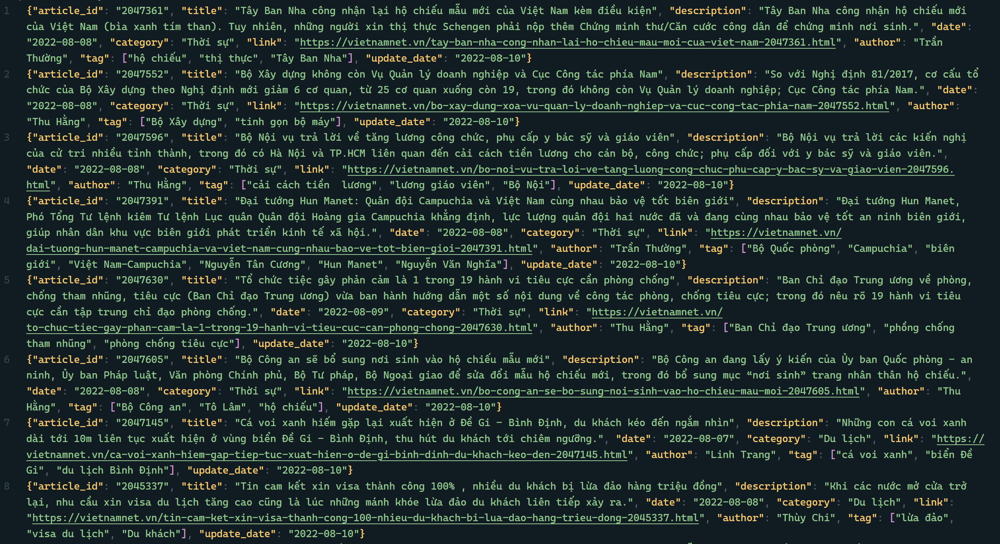
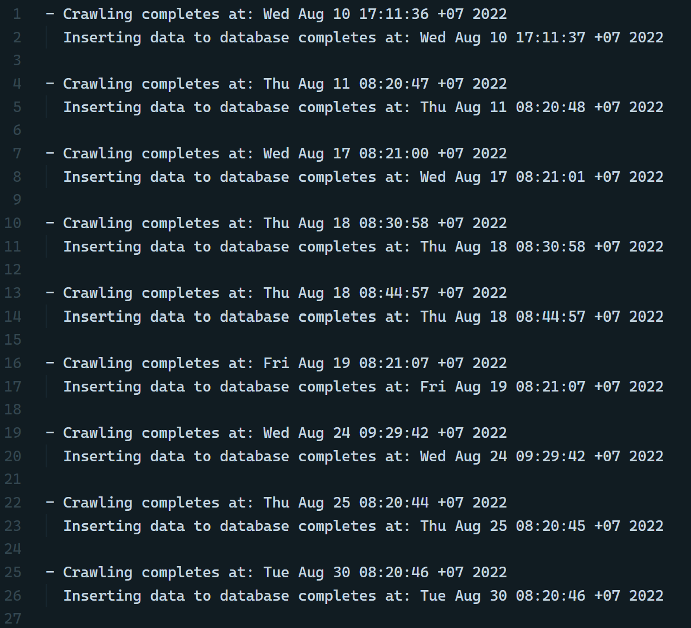
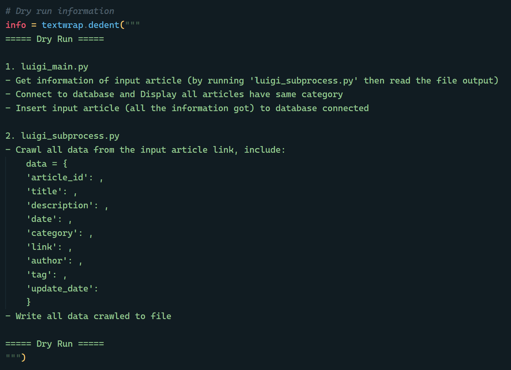

# Crawl data VietNamNet

This is my project from my time in university. This project include 2 phases: 
- Phase 1: Extract data (articles) from VietNamNet, perform appropriate Transformations, and Load into `MySQL`. Using `cron` for daily scheduling.
- Phase 2: Using `Luigi` for building simple data pipeline recommendation. The pipeline will return all articles that have the same category with the input articles.

Technologies used:
- Language: `Python`
- Crawl data tool: `Scrapy`
- Database: `MySQL`
- Database toolkit (ORM): `SQLAlchemy`
- Scheduling tool: `cron`
- Workflow management: `Luigi`


## What I do in Phase 1
Database design: [Link](https://dbdiagram.io/d/VietNamNet_DB-65e0a537cd45b569fb39acaa).

For crawling data, I use Scrapy for pull the articles from [VietNamNet](https://vietnamnet.vn/): start from the home page, I extract all the category links then follow them. Next, I only follow the articles' link in the **1st page**, and crawl them. The fields I crawl from each article can be seen below. Eventually, data crawled by the day are stored in `output` folder.
```
data = {
    'article_id': ...
    'title': ...
    'description': ...
    'date': ...
    'category': ...
    'link': ...
    'author': ...
    'tag': ...
    'update_date': ...
}
```

For database (in `database` folder), I connect to `MySQL` and create schema by `SQLAlchemy`. Data is inserted by reading crawled data. If it already existed, it's simply skipped. For this reason, database consists of only distinct records.

Finally, for daily crawl, I use `cron` command in Linux for scheduling. Daily crawl starts at 8:20 AM (GMT+7). `check.txt` file let me know the time of job completion.


## What I do in Phase 2 
2 new files `luigi_main.py` and `luigi_subprocess.py` are added in `phase2\tasks`, these contain all the code needed for Phase 2. 

- Firstly, the link of input article is placed in `luigi_subprocess.py`. This Python file will crawl all the data needed, then place in `phase2\output\luigi_article.jsonl`.

- Secondly, in `luigi_main.py`, the `luigi_subprocess.py` file are run as subprocess and the category of input article (one of data crawled as mention above) are used as a query to extract all related articles. Results are wrote in `phase2\output\luigi_output.jsonl`.

- Finally, input article will be added to database (if it doesn't exist).

Run the code:
```
luigi --module phase2.tasks.luigi_main GetArticleTask --dry-run=True --local-scheduler # Dry run mode

luigi --module phase2.tasks.luigi_main GetArticleTask --dry-run=False --local-scheduler # Actually run the code
```

## Results




